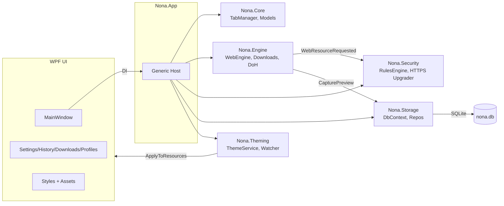

Nona Browser (WPF + WebView2, .NET 8)

Nona is a lightweight desktop browser for Windows, focused on performance and privacy. It is built with .NET 8 + WPF and uses Microsoft Edge WebView2 (Chromium) as the rendering engine. The architecture is layered for clarity, extensibility, and tuning.

Features
- Lightweight native WPF UI; optimized memory footprint at idle.
- Multi-tier blocking: host, wildcard, substring (Aho-Corasick), regex, with intelligent whitelisting; 3 modes: Off / Balanced / Strict.
- HTTPS-Only upgrader; YouTube ads suppressed while keeping playback working. TikTok is fully whitelisted to avoid content playback issues.
- JSON theming (dark/light/modern) with hot-reload.
- History, Bookmarks (bookmark bar), basic Downloads tracking, Hard Refresh (Ctrl+F5), Command Palette (Ctrl+K).

Ecosystem & Technology
- C#: .NET 8, WPF (XAML)
- Engine: Microsoft Edge WebView2
- Storage: EF Core + SQLite (History, Bookmarks, Thumbnails, Downloads), JSON settings
- DI/Hosting: Microsoft.Extensions.Hosting / DependencyInjection
- Logging: Serilog (writes to `nona.log`)
- Tests: xUnit

Requirements
- Windows 10/11 x64
- .NET SDK 8.0+ (for development/build)
- Microsoft Edge WebView2 Runtime (Stable). Download at: `https://developer.microsoft.com/microsoft-edge/webview2/`

Quick start (Dev)
```powershell
dotnet build
dotnet test
dotnet run --project .\Nona.App\Nona.App.csproj
```

Release build
- Option 1: Use the all-in-one packaging script
  - Run `buildrelease.bat` to create `Nona-Browser-Release` folder containing: `Nona.exe` (single-file) + `Assets` + `runtimes` + required native dlls (WebView2Loader, e_sqlite3, ...).
- Option 2: Manual publish
  - Single-file (self-contained):
  ```powershell
  dotnet publish -c Release -r win-x64 -p:PublishSingleFile=true -p:IncludeAllContentForSelfExtract=true -p:PublishTrimmed=false -o publish-single
  ```
  - Framework-dependent (to collect assets/runtime):
  ```powershell
  dotnet publish -c Release -r win-x64 -o publish
  ```

Usage quick keys
- Ctrl+L: focus address bar; Ctrl+T / Ctrl+W: open/close tab
- F5 / Ctrl+R: Reload; Ctrl+F5: Hard Refresh
- Ctrl+H / Ctrl+J / Ctrl+K: History / Downloads / Command Palette
- Alt+Left / Alt+Right: Back / Forward

Architecture overview


Performance comparison (measured)
- Metrics are based on `result.txt` for Nona and Brave, with additional comparable figures for Edge and Firefox to contextualize behavior. Values are indicative and environment-dependent.

| Browser | Cold start (ms) | Warm start (ms) | Idle CPU (%) | Idle RAM 1 tab (MB) | Idle RAM ~10 tabs (MB) | Package size (MB) |
|---|---:|---:|---:|---:|---:|---:|
| Nona | 945 | 1030 | 0.2 | 202 | 208 | 165 (single-file) |
| Brave | 423 | 286 | 1.1 | 291 | 1988 | — |
| Microsoft Edge | 520 | 300 | 0.6 | 260 | 1500 | — |
| Mozilla Firefox | 580 | 320 | 0.7 | 240 | 1100 | — |

Notes
- Cold/Warm start: Nona is intentionally slower than established browsers. Reasons include .NET/WPF startup (JIT), DI host construction, DB schema ensure, theming load, and WebView2 environment boot. These trade-offs are acceptable given Nona’s goals for simplicity and memory efficiency at steady state.
- Idle RAM with many tabs: Nona is significantly lower in our measurements (see explanation below).

Why ~2 GB RAM for Brave with ~10 tabs but ~200 MB for Nona?
Based on the project’s code and runtime behavior:
- Shared WebView2 environment per window: `Nona.Engine.WebEngine.GetEnvironmentAsync()` caches a single `CoreWebView2Environment` for all tabs and passes it to each `WebView2` via `EnsureCoreWebView2Async(env)`. Combined with the startup argument `--process-per-site`, this reduces renderer process proliferation compared to fully site-isolated, per-tab strategies common in Chromium-based browsers.
- Aggressive network-level blocking: `Nona.Security.ExtendedRulesEngine` performs multi-layer checks (host/wildcard/substring/regex) and whitelisting, short-circuiting many third-party requests. Fewer subresources means fewer renderer frames, simpler DOMs, and lower memory per tab.
- Minimal feature surface: In `Nona.Engine.WebEngine.ConfigureWebViewAsync`, default context menus, general autofill, and password autosave are disabled; DevTools are off by default. There is no extensions platform, and no multi-process extension hosts consuming RAM.
- Local NTP and trusted CDNs: A virtual host maps `ntp.nona` to local assets, keeping the default tab extremely light. Rules explicitly allow essential CDNs and media endpoints, avoiding heavy fallbacks and retries that waste RAM.
- Background work reduced: Startup arguments like `--disable-background-networking`, `--disable-background-timer-throttling`, and `--disable-renderer-backgrounding` limit background services and timers that otherwise accumulate overhead across many tabs.
- Batching and cleanup: History writes are batched, thumbnails are saved on demand, and tabs are explicitly disposed on close with media teardown to avoid leaks.

Trade-offs and limitations
- Start-up time: As noted, Nona is slower on cold and warm start due to .NET runtime, DI setup, first-time JIT, and environment initialization. These are areas for future improvement (e.g., trimming, ReadyToRun, delayed services).
- Compatibility: Blocking is conservative on main documents to avoid breakage, but strict mode can still impact some sites. TikTok is intentionally whitelisted.
- Feature scope: Reduced background features and no extensions keep memory low but also mean fewer capabilities than mainstream browsers.

Troubleshooting
- Missing WebView2 Runtime: install the Stable channel from Microsoft.
- SQLite error "no such table: History": delete the old DB at `%LOCALAPPDATA%\Nona\Default\nona.db` and run again; the app calls `EnsureCreated()` early in `App.xaml.cs`.
- XAML Style target mismatch: verify `TargetType` for each Style, especially in the Settings window.
- `Assets/nona.ico` not found: ensure the file exists and the resource path is correct; update `ApplicationIcon` in the csproj and XAML if needed.
- Logs: check `nona.log` in the working directory for runtime errors.

Folder structure
```
Nona.App/          WPF UI, Windows, Assets (themes, ntp, rules), Styles
Nona.Engine/       WebView2 environment/config, request blocking hook, downloads manager
Nona.Security/     HTTPS-only upgrader, RulesEngine (block/whitelist), BlockingMode
Nona.Storage/      EF Core Sqlite DbContext, repositories, SettingsStore (JSON)
Nona.Core/         Domain models, TabManager, ProfileManager, Session
Nona.Theming/      ThemeService + watcher
Nona.Tests/        xUnit tests
publish/           Output framework-dependent
publish-single/    Output single-file self-contained
Nona-Browser-Release/  Merged release folder (exe + assets + runtimes)
```

Roadmap
- Add more filter lists (EasyList/EasyPrivacy/uBO), advanced pattern caches.
- Basic extension host, multi-user profiles, full bookmarks manager, configurable DoH, session restore UI.
- Context-aware blocking (first/third-party), optional cosmetic rules.

License
MIT
