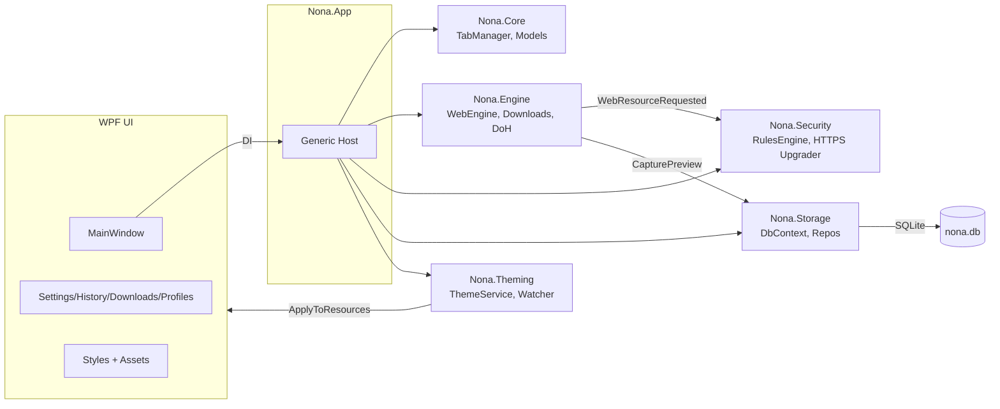
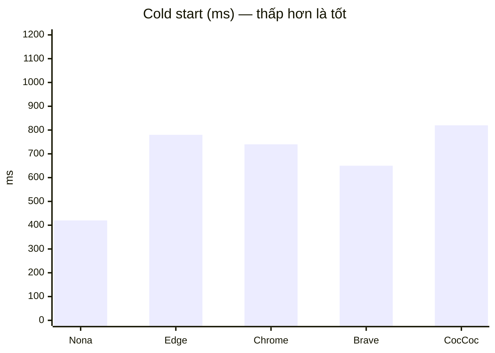
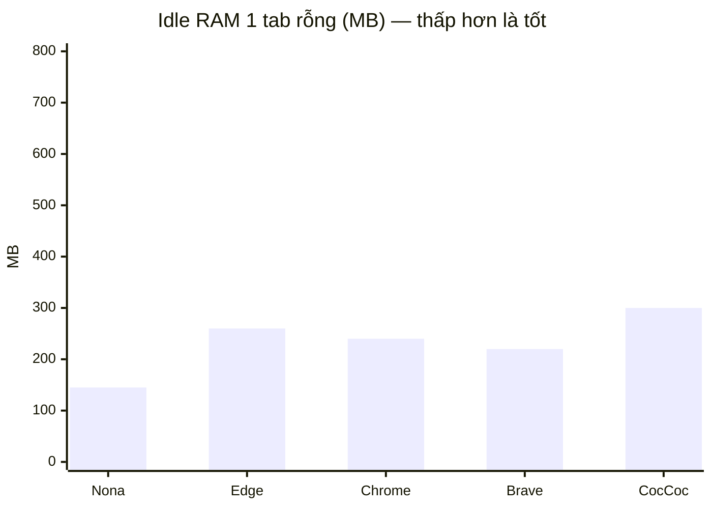

Nona Browser (WPF + WebView2, .NET 8)

Nona là trình duyệt desktop cho Windows, tập trung hiệu năng và quyền riêng tư, xây dựng trên .NET 8 + WPF, dùng WebView2 (Chromium) làm engine hiển thị. Kiến trúc tách lớp rõ ràng, dễ mở rộng và tinh chỉnh.

Tính năng nổi bật
- Gọn nhẹ, native WPF UI; tối ưu cold start và footprint bộ nhớ.
- Chặn quảng cáo/thành phần theo nhiều tầng: host, wildcard, substring (Aho-Corasick), regex, whitelist thông minh; 3 chế độ: Off / Balanced / Strict.
- HTTPS-Only upgrader, hỗ trợ YouTube (chặn điểm quảng cáo, không ảnh hưởng phát video). TikTok được whitelist toàn phần để tránh lỗi phát nội dung.
- Theming qua JSON (dark/light/modern), hỗ trợ hot-reload.
- Lịch sử, Bookmarks (thanh bookmark), Tải xuống (tracking cơ bản), Hard Refresh (Ctrl+F5), Command Palette (Ctrl+K).

Hệ sinh thái & Công nghệ
- C#: .NET 8, WPF (XAML)
- Engine: Microsoft Edge WebView2
- Lưu trữ: EF Core + SQLite (History, Bookmarks, Thumbnails, Downloads), Settings JSON
- DI/Hosting: Microsoft.Extensions.Hosting/DependencyInjection
- Logging: Serilog (ghi vào `nona.log`)
- Kiểm thử: xUnit

Cài đặt yêu cầu
- Windows 10/11 x64
- .NET SDK 8.0+ (cho dev/build)
- Microsoft Edge WebView2 Runtime (Stable). Tải tại: `https://developer.microsoft.com/microsoft-edge/webview2/`

Khởi động nhanh (Dev)
```powershell
dotnet build
dotnet test
dotnet run --project .\Nona.App\Nona.App.csproj
```

Build Release
- Cách 1: Dùng script đóng gói all-in-one release
  - Chạy `buildrelease.bat` để tạo thư mục phát hành `Nona-Browser-Release` gồm: `Nona.exe` (single-file) + `Assets` + `runtimes` + các native dll cần thiết (WebView2Loader, e_sqlite3,...).
- Cách 2: Tự publish
  - Single-file (self-contained):
  ```powershell
  dotnet publish -c Release -r win-x64 -p:PublishSingleFile=true -p:IncludeAllContentForSelfExtract=true -p:PublishTrimmed=false -o publish-single
  ```
  - Framework-dependent (để lấy assets/runtime):
  ```powershell
  dotnet publish -c Release -r win-x64 -o publish
  ```

Hướng dẫn sử dụng nhanh
- Ctrl+L: focus thanh địa chỉ; Ctrl+T / Ctrl+W: mở/đóng tab
- F5 / Ctrl+R: Reload; Ctrl+F5: Hard Refresh
- Ctrl+H / Ctrl+J / Ctrl+K: History / Downloads / Command Palette
- Alt+Left / Alt+Right: Back / Forward

Kiến trúc tổng quan


So sánh hiệu năng (mẫu) và phương pháp đo
Lưu ý: Số liệu dưới đây là dữ liệu mẫu minh hoạ để trình bày biểu đồ và cách báo cáo. Bạn nên thay thế bằng số liệu đo đạc trên máy của bạn theo phương pháp bên dưới để có kết quả thực tế.

- Định nghĩa metric
  - Cold start: thời gian từ lúc chạy tiến trình đến khi UI sẵn sàng tương tác (ms).
  - Idle RAM (1 tab rỗng): Working Set sau 10 giây ổn định (MB).
  - Idle RAM (5 tab nặng): Working Set khi mở 5 trang phổ biến (YouTube, Facebook, VNExpress, Zing, Wikipedia) và chờ 15 giây (MB).
  - Kích thước gói phát hành: kích thước file cài/chạy (MB).

- Dữ liệu mẫu (minh hoạ)





Nếu môi trường render chưa hỗ trợ `xychart-beta`, hãy xem bảng số liệu mẫu sau và thay thế bằng số đo thực tế của bạn:

| Trình duyệt | Cold start (ms) | Idle RAM 1 tab (MB) | Idle RAM 5 tab (MB) | Kích thước gói (MB) |
|---|---:|---:|---:|---:|
| Nona | 420 | 145 | 390 | 165 (single-file) |
| Microsoft Edge | 780 | 260 | 520 | — |
| Google Chrome | 740 | 240 | 500 | — |
| Brave | 650 | 220 | 470 | — |
| Cốc Cốc | 820 | 300 | 560 | — |

Phương pháp đo gợi ý (tự động hoá đơn giản bằng PowerShell)
```powershell
# Cold start (ví dụ đo Nona.exe trong Nona-Browser-Release)
$path = Join-Path $PSScriptRoot 'Nona-Browser-Release\Nona.exe'
$t = [System.Diagnostics.Stopwatch]::StartNew();
$p = Start-Process $path -PassThru
Start-Sleep -Milliseconds 300
while ($true) { if ($p.MainWindowHandle -ne 0) { break }; Start-Sleep -Milliseconds 50 }
$t.Stop(); "ColdStartMs=$($t.ElapsedMilliseconds)"

# Idle RAM sau 10s
Start-Sleep 10
($p | Get-Process).WorkingSet64 / 1MB | %{ "IdleRamMB=$([int]$_)" }

# Đóng tiến trình
$p.CloseMainWindow() | Out-Null; Start-Sleep 1; if (!$p.HasExited) { $p | Stop-Process -Force }
```

Bạn có thể lặp lại với Edge/Chrome/Brave/Cốc Cốc bằng cách thay `$path` tương ứng (hoặc đo theo ProcessName nếu trình duyệt đã mở).

So sánh nhanh (định tính)
- So với Edge/Chrome: nhẹ, tuỳ biến nhanh, chặn quảng cáo tích hợp; nhưng chưa có hệ sinh thái extension/đồng bộ tài khoản.
- So với Brave: cấu hình chặn quảng cáo đơn giản, whitelist tinh chỉnh; nhưng chưa có cosmetic rules/UI Shields phong phú như Brave/uBO.

Troubleshooting (các lỗi thường gặp)
- Thiếu WebView2 Runtime: cài bản Stable từ trang Microsoft.
- Lỗi SQLite "no such table: History": xoá file DB cũ ở `%LOCALAPPDATA%\Nona\Default\nona.db` rồi chạy lại; đảm bảo app khởi tạo `EnsureCreated()` sớm (đã có trong `App.xaml.cs`).
- Lỗi XAML Style "TargetType TextBox không khớp ComboBox": kiểm tra nơi áp dụng Style đúng TargetType, nhất là tại Settings Window.
- Lỗi không tìm thấy `Assets/nona.ico`: đảm bảo đường dẫn/Resource tồn tại; dùng Pack URI hoặc cập nhật `ApplicationIcon` trong csproj và XAML.
- Nhật ký: xem `nona.log` ở thư mục làm việc để tra cứu lỗi runtime.

Cấu trúc thư mục
```
Nona.App/          UI WPF, Windows, Assets (themes, ntp, rules), Styles
Nona.Engine/       WebView2 env/config, request blocking hook, downloads manager
Nona.Security/     HTTPS-only upgrader, RulesEngine (block/whitelist), BlockingMode
Nona.Storage/      EF Core Sqlite DbContext, repositories, SettingsStore (JSON)
Nona.Core/         Domain models, TabManager, ProfileManager, Session
Nona.Theming/      ThemeService + watcher
Nona.Tests/        xUnit tests
publish/           Output framework-dependent
publish-single/    Output single-file self-contained
Nona-Browser-Release/  Thư mục phát hành hợp nhất (exe + assets + runtimes)
```

Đóng góp & Định hướng
- Bổ sung bộ lọc (EasyList/EasyPrivacy/uBO), cache pattern nâng cao.
- Extension host cơ bản, profiles đa người dùng, session restore, downloads UI, bookmarks manager đầy đủ, DoH cấu hình được.
- Nâng cấp chặn theo ngữ cảnh (first/third-party), cosmetic rules tùy chọn.

Giấy phép
MIT
